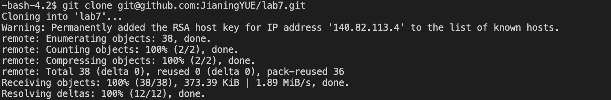
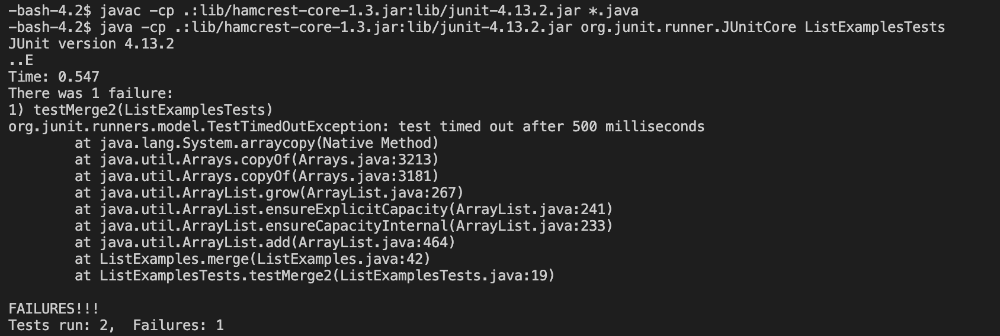
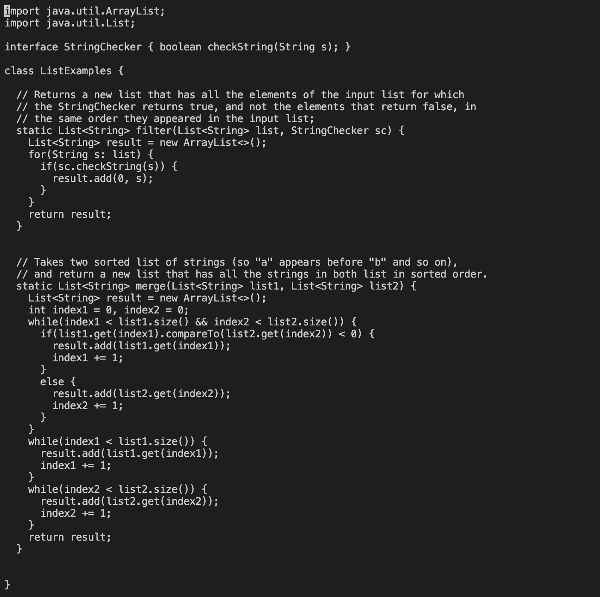
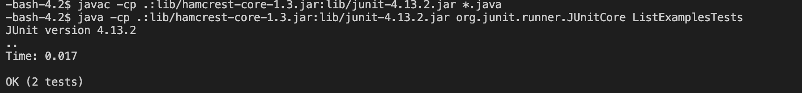
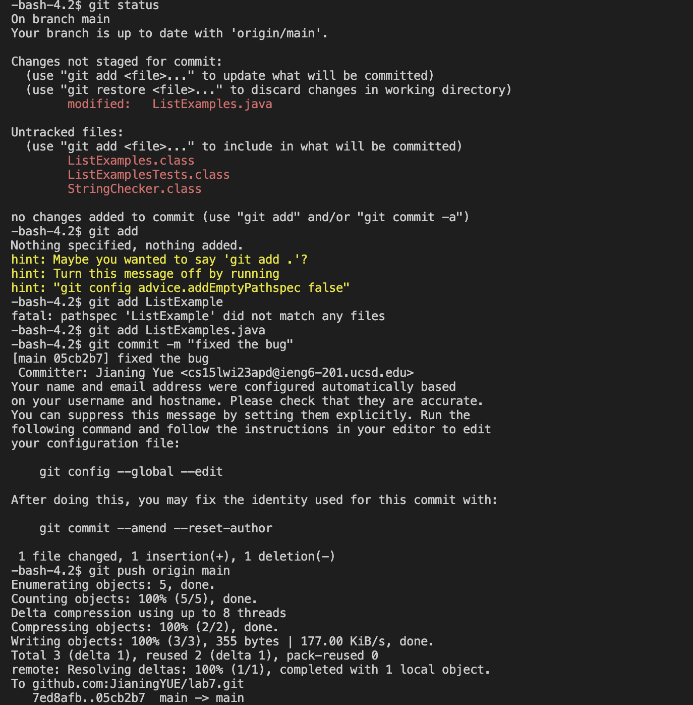

From Step 4, log in to the ieng6 accont, because I already setted up, so i don't need password to log in.

Keys pressed: ssh `<tab>` cs15lwi23apd@ieng6.ucsd.edu `<enter>`

Srep 5: clone the fork of the repository from my Github account. use git clone + path to clone. use copy and paste for the path.

Keys pressed: git `<tab>` clone `<tab> <command + v>` 

Step 6: test the file, use to command from week 3, also use cope and paste.

Keys pressed: `<command + v>` then `<enter>` then `<command + v>` and `<enter>`

Step 7: fix the bug with `nano` command.

Keys pressed: nano `<tab>` ListExamples.java `<enter>` then use `<down> x 42 times` then `<left> x 12 times` then change 1 to 2 with `<delate>`
To save and quit the `nano`, use `<control x>` then press Y to save the change. Then use `<enter>` to comfirm quit.

Step 7: Retest the file with the same command with Step 6.

Key pressed: `<up>` x 7 times then `<enter>`. `<up> x 7 times` then `<enter>`. The javac -cp .:lib/hamcrest-core-1.3.jar:lib/junit-4.13.2.jar *.java command was 7 up in the search history, so I used up arrow to access it. Then the java -cp .:lib/hamcrest-core-1.3.jar:lib/junit-4.13.2.jar org.junit.runner.JUnitCore ListExamplesTests command was 7 up in the history, so I accessed and ran it in the same way.

Step 8: Commit and push

Key pressed:`<git status> + <git add ListExamples.java> + <git commit -m "fixed the bug"> + <git push origin main>`
